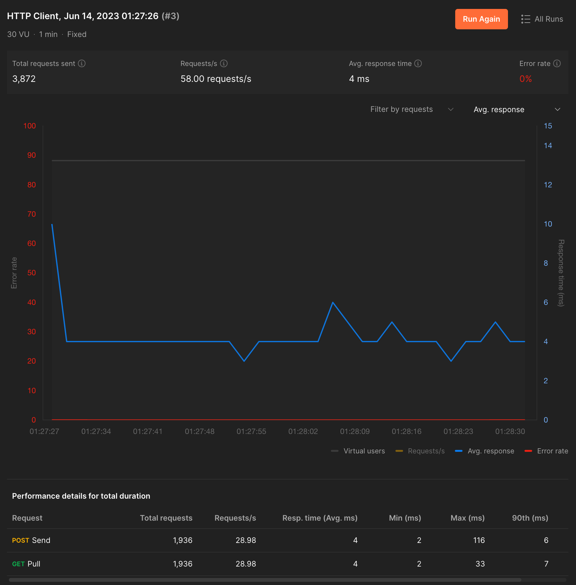

# TikTok Tech Immersion


This is the completed backend assignment of 2023 TikTok Tech Immersion.

## Installation

Requirement:

- golang 1.18+
- docker
- docker-compose

To install dependency tools:

```bash
make pre
```

## Setup

### Clone the repository

**Using HTTPS**

```bash
git clone https://github.com/xinweilau/tiktok_assignment_2023.git
```

**Using SSH**

```bash
git clone git@github.com:xinweilau/tiktok_assignment_2023.git
```

## Run

```bash
docker-compose up -d
```

Check if it's running:

```bash
curl localhost:8080/ping
```

## API Specifications

The available HTTP endpoints to communicate with the RPC server.

| Request Type | Endpoint  | Response Codes |
| ------------ | --------- | -------------- |
| GET          | /api/pull | 200, 500       |
| POST         | /api/send | 200, 500       |

### /api/pull

<table>
<tr>
<td> Request Body </td> <td> Response </td>
</tr>
<tr>
<td>

```json
{
  "chat": "Lorem:Ipsum",
  "cursor": 0,
  "limit": 20,
  "reverse": true
}
```

</td>
<td>

```json
{
  "messages": [
    {
      "chat": "Lorem:Ipsum",
      "text": "Lorem Ipsum",
      "sender": "Lorem",
      "send_time": 1686678550
    }
  ]
}
```

</td>
</tr>
</table>

### /api/send

<table>
<tr>
<td> Request Body </td> <td> Response </td>
</tr>
<tr>
<td>

```json
{
  "chat": "Lorem:Ipsum",
  "text": "Lorem Ipsum",
  "sender": "Lorem"
}
```

</td>
<td>
<i>N/A</i>
</td>
</tr>
</table>

## Performance Test (30VU over 1min, 28.98req/s)


